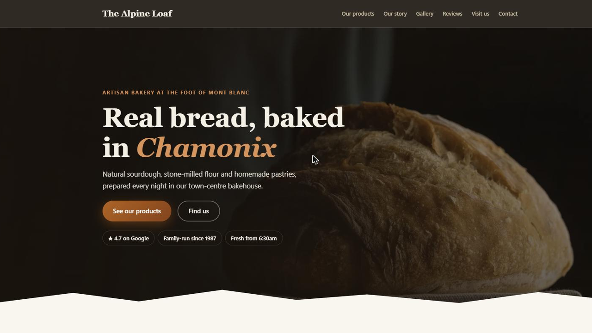

# Chalet 🏔️

**The Astro theme for local businesses.**

Built in the Chamonix valley and battle-tested on real small-business sites,
Chalet gets a bakery, restaurant, guesthouse, salon or workshop online in a
day — with the local SEO and privacy boxes already ticked.

> **One config file. Local SEO built in. GDPR-ready. No cookies, no trackers,
> (almost) no JavaScript.**

[Live demo](https://astro-chalet.vercel.app) · [Changelog](CHANGELOG.md) · MIT license



## Why Chalet?

Most themes are built for startups and portfolios. Local businesses have
different needs: show up on Google Maps, publish opening hours that Google can
read, collect quote requests, and stay on the right side of EU privacy rules —
all without a maintenance burden.

- **Everything is one file.** All copy, contact details, opening hours,
  services, reviews, FAQ and legal info live in `src/config/site.ts`.
  Components contain zero hard-coded text.
- **Local SEO that actually works.** `schema.org/LocalBusiness` and `FAQPage`
  JSON-LD generated from your config, canonical URLs, Open Graph, Twitter
  cards, sitemap and robots.txt.
- **GDPR-friendly by default.** No cookies, no third-party requests, no web
  font CDN, no embedded maps. Privacy policy and legal notice pages included.
  For most brochure sites this means **no cookie banner needed**.
- **Fast by design.** Static HTML, system fonts, inline SVG icons, one ~10-line
  script for the mobile menu. Built to score ~100 across Lighthouse.
- **Designed to sell.** Dramatic dark hero with trust badges, aggregate
  review score computed from your reviews, hover micro-interactions and
  pure-CSS scroll reveals (zero JavaScript, reduced-motion friendly).
- **Any language.** Every UI string is in the config too — translate one file
  to ship the site in French, German, Italian... A complete French example is
  included in [`examples/french-bakery/`](examples/french-bakery/).
- **Accessible.** Skip link, visible focus states, reduced-motion support,
  WCAG AA color contrast, semantic markup.

## Quick start

```bash
# Use this repo as a template (or clone it), then:
npm install     # Node >= 22.12
npm run dev     # http://localhost:4321
npm run build   # generates the static site in dist/
```

## Make it yours — checklist

1. **`src/config/site.ts`** — the ONE file. Identity, contact details,
   opening hours, services, reviews (copied from your Google profile), FAQ,
   hero copy, legal info, UI strings.
2. **`src/styles/tokens.css`** — the palette and typography. Colors are named
   by role; an alternative "alpine" palette ships in a comment so you can see
   how re-theming works. Check contrast if you change colors
   ([WebAIM checker](https://webaim.org/resources/contrastchecker/)).
3. **`public/images/`** — replace the SVG placeholders with real photos (keep
   the same file names or update the paths in `site.ts`). Recommended:
   AVIF/WebP, ≤ 200 KB each.
4. **`public/robots.txt`** — set the sitemap URL to your real domain.
5. **`src/pages/index.astro`** — reorder or remove sections (one line each).
6. **`src/pages/legal-notice.astro` / `privacy-policy.astro`** — adapt the
   prose to your jurisdiction (French versions in `examples/french-bakery/`).
7. **Deploy** — Vercel, Netlify or any static host: import the repo, the
   framework is auto-detected. Then plug in your domain.

## Sections

Nine modular sections, assembled in `src/pages/index.astro`:

| Section | What it does |
|---|---|
| `Hero` | First screen: eyebrow, headline, two CTAs, LCP-optimized image |
| `Services` | 3–6 cards with inline SVG icons (see `Icon.astro` to add your own) |
| `About` | The story of the business — text + photo |
| `Gallery` | Lazy-loaded image grid with a gentle hover zoom |
| `Reviews` | Google reviews with SVG star ratings + link to the profile |
| `CtaBanner` | Accent-colored banner with one clear call to action |
| `Faq` | Native `<details>` accordion + FAQPage JSON-LD for rich results |
| `PracticalInfo` | Opening hours table + address + Google Maps directions link |
| `Contact` | Form with honeypot anti-spam, or mailto fallback |

## The contact form

`SITE.contact.endpoint` controls the behavior:

- `""` (default) — no broken form: a prominent **mailto button** is shown.
- A **Formspree/Basin URL** — the form works immediately, no backend.
- **Your own backend** — any endpoint accepting a classic form POST. The
  hidden honeypot field (name configurable via `contact.honeypotField`) lets
  your backend silently reject bots that fill it in.

## SEO after launch

- Validate the structured data with the
  [Rich Results Test](https://search.google.com/test/rich-results) —
  LocalBusiness and FAQPage should both be detected.
- Declare the site in Google Search Console and submit `/sitemap-index.xml`.
- Add the site URL to the business's Google Business Profile.

## FAQ

**Why system fonts instead of a nice web font?**
Zero download = faster first paint, and no Google Fonts CDN request (which EU
courts have ruled a GDPR issue). To use a brand font, self-host it with
`@font-face` + `font-display: swap` and update `--font-heading`/`--font-body`
in `tokens.css`.

**Where do I change the colors?**
`src/styles/tokens.css` — ten CSS variables re-theme the whole site.
Components never use raw color values.

**Can I use it for a client project?**
Yes — MIT license. Attribution appreciated, never required.

**Does it support multiple languages on one site?**
One language per site (set `SITE.lang`). For a bilingual site, the simplest
route today is two deployments with two config files; native i18n routing is
on the roadmap.

## License

[MIT](LICENSE) © 2026 Antoine Grange.
Built in Chamonix-Mont-Blanc, at the foot of the mountain. 🥖
